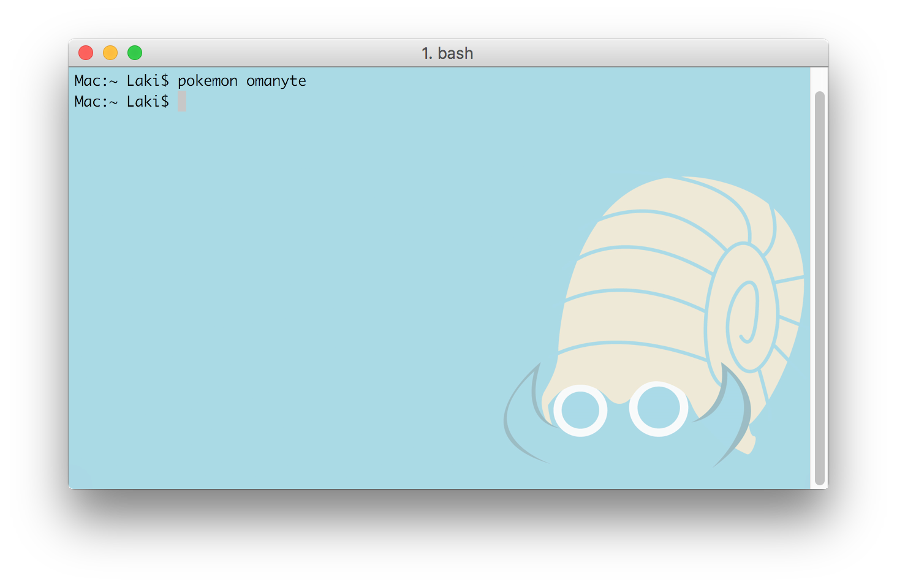

# Pokemon-Terminal


Sample Set #1                    |  Sample Set #2
:-------------------------------:|:-------------------------------:
|  
|  
 |  
   |  
      |  
  |  
  |  
  |  
|  
|  
    |  
 |  

# Features
- 493 unique Pokemon
- Select Pokemon by name or by index number
- Ability to change the Desktop Wallpaper & the Terminal background
- Internal search system for finding Pokemon

# How to Install

1. Make sure you have [Python 3.5](https://www.python.org/downloads/mac-osx/) or higher.
2. Make sure you have [iTerm2](http://www.iterm2.com/downloads.html). If you have homebrew you can install iTerm with the following command:
    ```
    brew cask install iterm2
    ```
3. Download the repository and unzip it.
4. Locate ~/.bash_profile and add the path to the repository so that it may be accessed from anywhere. Example:
    ```
    # Pokemon
    PATH="/Users/Laki/GitHub/Pokemon-Terminal:${PATH}"
    ```
5. Reload ~/.bash_profile so that the above changes are updated:
    ```
    $ source ~/.bash_profile
    ```
6. Now you can change the terminal background like so:
    ```
    $ pokemon pikachu
    ```

# Usage

```

Usage:
    pokemon [parameter]
    
Parameters:
    [name]        -   Change the terminal background to the specified Pokemon.
    [index]       -   Change the terminal background to a Pokemon by its index.
    [region]      -   List all the Pokemon of the specified region.
    [one letter]  -   List all Pokemon who's names begin with a particular letter.
    [two letters] -   List all Pokemon who's names begin with those two letters.
    
Other Parameters:
    pokemon all             -   List all the Pokemon supported.
    pokemon regions         -   List all the available regions.
    pokemon extra           -   List all the Pokemon from the 'Extra' folder.
    pokemon random          -   Change the terminal background to a random Pokemon.
    pokemon ?               -   Identify the current Pokemon in the terminal.
    pokemon _pikachu        -   Change the wallpaper to the specified Pokemon.
    pokemon _random         -   Change the wallpaper to a random Pokemon.
    pokemon _?              -   Identify the current Pokemon in the wallpaper.
    pokemon slideshow       -   Iterate through each Pokemon.
    pokemon slideshow-kanto -   Iterate through each Pokemon in the specified region.
    pokemon help            -   Display this menu.
    
```

Example:


# Suggestions

I highly suggest making the font colors black and the terminal window transparent. Some of the images have both light and dark colours and so it can be difficult to see the text sometimes. Transparency resolves this issue. Since *Pokemon Terminal* only changes the background, the transparency must be done manually:

1. Navigate to iTerm2 > Preferences > Profiles > Window
2. Set the transparency to the center value.
3. Hit the "blur" checkbox.
4. Set the blur to maximum.


The result should look like this:


# Adding Custom Images

The folder Images/Extra is for adding custom images. You can manually add backgrounds to this folder and they will be visible to the program. Only PNG format is supported. To see a list of all the custom backgrounds type:
```
$ pokemon extra
```
Alternatively, you can delete images from this folder and it will not break the program.


# Solutions for Issues

If you experience a line at the top of the terminal after changing the Pokemon, you can remove it by typing in the *clear* command or opening a new terminal.


# Saving

I have not yet implemented a way to save the background to a profile. To save a background you will need to setup a startup command in the profile.
1. Navigate to iTerm2 > Preferences > General
2. Locate the field where it says *Send text at start* under *Command*.
3. In that field type "pokemon [pokemon name]". You can see an example in the image down below.
4. You can leave out "; clear" if you don't care about the line showing up at the top of the terminal.


# Notes

- Nearly all of the Pokemon backgrounds were created by [Teej](https://pldh.net/gallery/the493).
- Originally the images were about 100mb in total but I used [pngquant](https://pngquant.org/) to compress them down to about 30mb.
- Since the images are compressed, a *few* of them have some mild compression artifacts that are noticeable if the terminal is in full screen.
