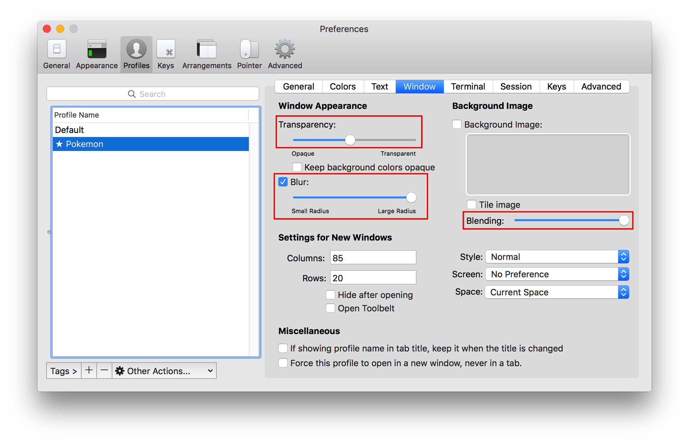

# Pokemon-Terminal


Sample Set #1                    |  Sample Set #2
:-------------------------------:|:-------------------------------:
|  
|  
 |  
   |  
      |  
  |  
  |  
  |  
|  
|  
    |  
 |  

# Features
- 493 unique Pokemon
- Select Pokemon by name or by index number
- Ability to change the Desktop Wallpaper & the Terminal background
- Internal search system for finding Pokemon
- Supports iTerm2, Terminology & Tilix

# How to Install

Type `python3 -V` in your terminal to verify that you have [Python 3.5](https://www.python.org/downloads/) or later installed.

## npm

You can install in any (npm-supported) OS using `npm install --global pokemon-terminal`. That's it, you're done!

> If you do not use npm, or prefer a manual install, continue reading.

## Mac OS

1. Make sure you have [Python 3.5](https://www.python.org/downloads/mac-osx/) or higher.
2. Make sure you have [iTerm2](http://www.iterm2.com/downloads.html).
3. Copy and paste the following for the installation:
    ```
    # Pokemon Installation
    git clone https://github.com/LazoCoder/Pokemon-Terminal $HOME/.Pokemon-Terminal
    echo PATH="$HOME/.Pokemon-Terminal:${PATH}" >> ~/.bash_profile
    source ~/.bash_profile
    ```
4. If you are using zsh, do the following instead:
    ```
    # Pokemon Installation
    git clone https://github.com/LazoCoder/Pokemon-Terminal $HOME/.Pokemon-Terminal
    echo PATH="$HOME/.Pokemon-Terminal:$"PATH"" >> ~/.zshrc
    source ~/.zshrc
    ```

## Linux

1. Make sure you have Python 3.5+ installed, check the instructions of your distribution.
2. Make sure you have Terminology or Tilix, again check the package manager of your distribution.
3. Install
    - If you are a Arch Linux User, you can install it from the AUR package [pokemon-terminal-git](https://aur.archlinux.org/packages/pokemon-terminal-git/).
    - Otherwise, copy and paste the following bash script into a terminal for the installation:
    ```bash
    # Pokemon Installation
    git clone https://github.com/LazoCoder/Pokemon-Terminal $HOME/.Pokemon-Terminal
    echo PATH="$HOME/.Pokemon-Terminal:$"PATH"" >> ~/.bash_profile
    source ~/.bash_profile
    ```

# Instructions
## Usage

```

Usage:
    pokemon [parameter]
    ichooseyou [parameter]

Parameters:
    [name]        -   Change the terminal background to the specified Pokemon.
    [index]       -   Change the terminal background to a Pokemon by its index.
    [region]      -   List all the Pokemon of the specified region.
    [one letter]  -   List all Pokemon who's names begin with a particular letter.
    [two letters] -   List all Pokemon who's names begin with those two letters.

Other Parameters:
    all                           -   List all the Pokemon supported.
    regions                       -   List all the available regions.
    extra                         -   List all the Pokemon from the 'Extra' folder.
    random                        -   Change the terminal background to a random Pokemon.
    random-<region>               -   Change the terminal background to a random Pokemon from the specified region.
    slideshow [time]              -   Iterate through each Pokemon. Optional time (in seconds) between Pokemon.
    slideshow-<region> [time]     -   Iterate through each Pokemon in the specified region. Optional time (in seconds) between Pokemon.
    rnd-slideshow [time]          -   Iterate through each Pokemon in a random order. Optional time (in seconds) between Pokemon.
    rnd-slideshow-<region> [time] -   Iterate through each Pokemon in the specified region in a random order. Optional time (in seconds) between Pokemon.
    light                         -   Change the terminal background to a random light-colored Pokemon.
    dark                          -   Change the terminal background to a random dark-colored Pokemon.
    type [type]                   -   Change to a random pokemon of said type.
    clear | disable | off         -   Clear the Pokemon in the terminal.
    help                          -   Display this menu.

Wallpaper Parameters:
    pokemon _pikachu              -   Change the wallpaper to the specified Pokemon.
    pokemon _random               -   Change the wallpaper to a random Pokemon.
    pokemon _random-kanto         -   Change the wallpaper to a random Pokemon from the specified region.

Search System Information:
    Any input containing 3 or more characters triggers the internal search system. Examples:
    "pokemon pika" changes the terminal background to Pikachu.
    "pokemon dos"  changes the terminal background to Gyarados.

```

Example:


# Suggestions

I highly suggest making the font colors black and the terminal window transparent. Some of the images have both light and dark colours and so it can be difficult to see the text sometimes. Transparency resolves this issue. Since *Pokemon Terminal* only changes the background, the transparency must be done manually:

1. Navigate to iTerm2 > Preferences > Profiles > Window
2. Set the transparency to about half way.
3. Hit the "blur" checkbox.
4. Set the blur to maximum.
5. Optionally you can set the blending to maximum to adjust the colors to look like the samples provided.



The result should look like this:


# Adding Custom Images

The folder *Images/Extra* is for adding custom images. You can manually add backgrounds to this folder and they will be visible to the program. Only JPG format is supported. To see a list of all the custom backgrounds type:
```
$ pokemon extra
```
Alternatively, you can delete images from this folder and it will not break the program. These are some custom backgrounds:


# Solutions for Common Issues

* If you experience a line at the top of the terminal after changing the Pokemon, you can remove it by typing in the *clear* command or opening a new terminal.


* If you are using Tilix and the terminal background is not changing, try adjusting the transparency in your profile settings.
* If you are experiencing issues with Terminology, make sure that you have installed the latest version:
   ```
   sudo add-apt-repository ppa:niko2040/e19
   sudo apt-get update
   sudo apt install terminology
   ```
* If you get the error: ```39:46: syntax error: Expected end of line but found identifier. (-2741)```. Locate the file ITerm.py in adapter/implementations and on line 7, change "iTerm" to "iTerm2". If you still experience the error, try changing it to "iTerm 2".

# Saving

## Mac OS
I have not yet implemented a way to save the terminal background to a profile. To save a background you will need to setup a startup command in the profile.
1. Navigate to iTerm2 > Preferences > General
2. Locate the field where it says *Send text at start* under *Command*.
3. In that field type "pokemon [pokemon name]". You can see an example in the image down below.
   - Alternatively you can also type "pokemon random" for a random theme each time you open up a new terminal.
4. You can leave out "; clear" if you don't care about the line showing up at the top of the terminal.


## Linux
Terminology already saves it automatically, just tick and remove the "temporary" tick in the settings just in case, after setting your desired pokemon (see image below).


However to setup a random pokemon each session do:
1. Open `~/.bashrc` in your favorite text editor.
2. Make sure your `~/.bashrc` file has a guard check for interactive terminals, so you don't try to set the background every possible time bash runs. Place this before any command that may produce any output (again, if you don't have it already, and variable setting, e.g `exports` don't produce output):
``` bash
if [[ $- != *i* ]]; then #You might have this already
    return
fi
```
3. You may also want to check if terminology is actually running before trying to set the background, so that leads us to
```bash
if [[ "$TERMINOLOGY" -eq "1" ]]; then
    pokemon random
fi
```

# Notes & Credits

- Nearly all of the Pokemon backgrounds were created by [Teej](https://pldh.net/gallery/the493).
- Originally the images were about 100mb in total but [ImageOptim](https://imageoptim.com/) was used to compress them down to about 17mb.
- Since the images are compressed, some of them may have some mild (but negligible) compression artifacts.
- Thanks to [@DrMartinLutherXing](https://github.com/DrMartinLutherXing) for some bug fixes.
- Thanks to [@joanbono](https://github.com/joanbono) for the easy installation script in the readme.
- Thanks to [@BnMcG](https://github.com/BnMcG) for the region specific randomize function.
- Thanks to [@samosaara](https://github.com/samosaara) for the Linux (GNOME and Terminology) port.
- Thanks to [@charlesmilette](https://github.com/charlesmilette) for maintaining the AUR package.
- Thanks to [@therealklanni](https://github.com/therealklanni) for adding the project to npm.
- Thanks to [@MattMattV](https://github.com/MattMattV) for adding Tilix support.
- Thanks to [@connordinho](https://github.com/connordinho) for enhancing the slideshow functionality.
- Thanks to [@cclauss](https://github.com/cclauss) for simplifying the code in the database class and the main class.
- Thanks to [@Fiskie](https://github.com/Fiskie) for implementing the adapter design pattern, piping commands and more.
- Thanks to [@marcobiedermann](https://github.com/marcobiedermann) for better image compression.
- Thanks to [@kamil157](https://github.com/kamil157) and [@dosman711](https://github.com/dosman711) for the randomized slideshow function.
