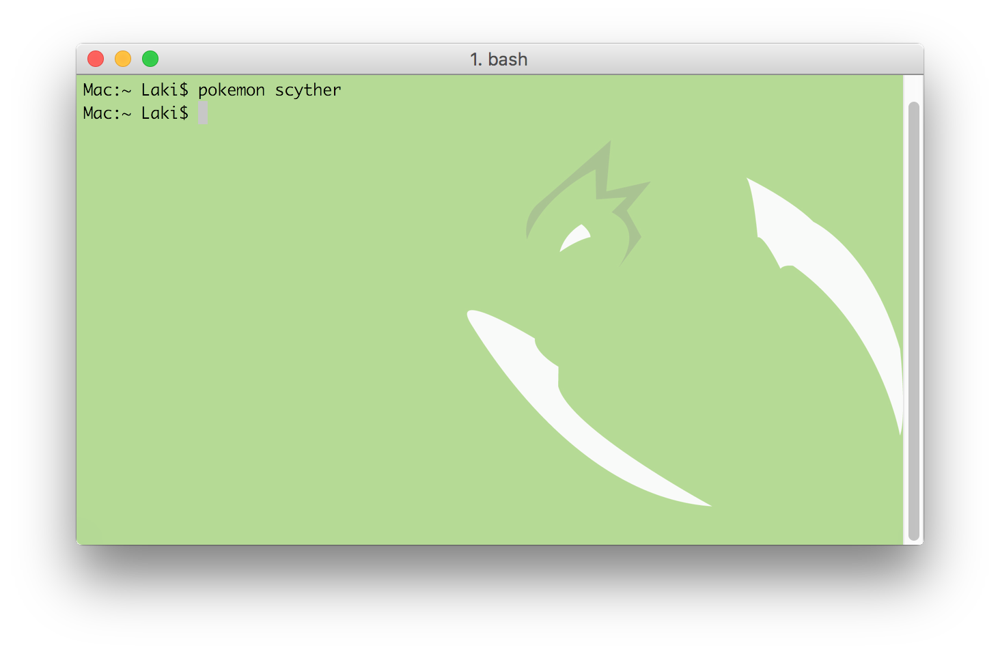

# Pokemon-Terminal


Sample Set #1                    |  Sample Set #2
:-------------------------------:|:-------------------------------:
|  
|  
 |  
   |  
      |  
  |  
  |  
  |  
|  
|  
    |  
 |  

# Features
- 493 unique Pokemon
- Select Pokemon by name or by index number
- Ability to change the Desktop Wallpaper & the Terminal background
- Internal search system for finding Pokemon

# How to Install

## Mac OS

1. Make sure you have [Python 3.5](https://www.python.org/downloads/mac-osx/) or higher.
2. Make sure you have [iTerm2](http://www.iterm2.com/downloads.html).
3. Copy and paste the following for the installation:
    ```
    # Pokemon Installation
    git clone https://github.com/LazoCoder/Pokemon-Terminal $HOME/.Pokemon-Terminal
    echo PATH="$HOME/.Pokemon-Terminal:${PATH}" >> ~/.bash_profile
    source ~/.bash_profile
    ```
4. Now you can change the terminal background like so:
    ```
    $ pokemon pikachu
    ```

## Linux

1. Make sure you have Python 3.5+ installed, check the instructions of your distribution.
2. Make sure you have Terminology, again check the package manager of your distribution.
3.
	- If you are a Arch Linux User, you can install it from the AUR package [pokemon-terminal-git](https://aur.archlinux.org/packages/pokemon-terminal-git/).
	- If you aren't a Arch Linux user, copy and paste the following into a terminal for the installation:
```bash
# Pokemon Installation
git clone https://github.com/LazoCoder/Pokemon-Terminal $HOME/.Pokemon-Terminal
echo PATH="$HOME/.Pokemon-Terminal:$"PATH"" >> ~/.bash_profile
source ~/.bash_profile
```
4. Now you can change the terminal background like so:
```
pokemon pikachu
```

# Instructions
## Usage

```

Usage:
    pokemon [parameter]

Parameters:
    [name]        -   Change the terminal background to the specified Pokemon.
    [index]       -   Change the terminal background to a Pokemon by its index.
    [region]      -   List all the Pokemon of the specified region.
    [one letter]  -   List all Pokemon who's names begin with a particular letter.
    [two letters] -   List all Pokemon who's names begin with those two letters.

Other Parameters:
    pokemon all             -   List all the Pokemon supported.
    pokemon regions         -   List all the available regions.
    pokemon extra           -   List all the Pokemon from the 'Extra' folder.
    pokemon random          -   Change the terminal background to a random Pokemon.
    pokemon random-kanto    -   Change the terminal background to a random Pokemon from the specified region.
    pokemon ?               -   Identify the current Pokemon in the terminal.
    pokemon _pikachu        -   Change the wallpaper to the specified Pokemon.
    pokemon _random         -   Change the wallpaper to a random Pokemon.
    pokemon _random-kanto   -   Change the wallpaper to a random Pokemon from the specified region.
    pokemon _?              -   Identify the current Pokemon in the wallpaper.
    pokemon slideshow       -   Iterate through each Pokemon.
    pokemon slideshow-kanto -   Iterate through each Pokemon in the specified region.
    pokemon clear           -   Clear the Pokemon in the terminal.
    pokemon help            -   Display this menu.

```

Example:


# Suggestions

I highly suggest making the font colors black and the terminal window transparent. Some of the images have both light and dark colours and so it can be difficult to see the text sometimes. Transparency resolves this issue. Since *Pokemon Terminal* only changes the background, the transparency must be done manually:

1. Navigate to iTerm2 > Preferences > Profiles > Window
2. Set the transparency to about half way.
3. Hit the "blur" checkbox.
4. Set the blur to maximum.
5. Optionally you can set the blending to maximum to adjust the colors to look like the samples provided.


The result should look like this:


# Adding Custom Images

The folder *Images/Extra* is for adding custom images. You can manually add backgrounds to this folder and they will be visible to the program. Only PNG format is supported. To see a list of all the custom backgrounds type:
```
$ pokemon extra
```
Alternatively, you can delete images from this folder and it will not break the program. These are some custom backgrounds:


# Solutions for Issues

If you experience a line at the top of the terminal after changing the Pokemon, you can remove it by typing in the *clear* command or opening a new terminal.


# Saving

## Mac OS
I have not yet implemented a way to save the terminal background to a profile. To save a background you will need to setup a startup command in the profile.
1. Navigate to iTerm2 > Preferences > General
2. Locate the field where it says *Send text at start* under *Command*.
3. In that field type "pokemon [pokemon name]". You can see an example in the image down below.
4. You can leave out "; clear" if you don't care about the line showing up at the top of the terminal.


## Linux
Terminology already saves it automatically, just tick and remove the "temporary" tick in the settings just in case, after setting your desired pokemon (see image below).


However to setup a random pokemon each session do:
1. Open `~/.bashrc` in your favorite text editor.
2. Make sure your `~/.bashrc` file has a guard check for interactive terminals, so you don't try to set the background every possible time bash runs. Place this before any command that may produce any output (again, if you don't have it already, and variable setting, e.g `exports` don't produce output):
``` bash
if [[ $- != *i* ]]; then #You might have this already
    return
fi
```
3. You may also want to check if terminology is actually running before trying to set the background, so that leads us to
```bash
if [[ "$TERMINOLOGY" -eq "1" ]]; then
    pokemon random
fi
```

# Notes & Credits

- Nearly all of the Pokemon backgrounds were created by [Teej](https://pldh.net/gallery/the493).
- Originally the images were about 100mb in total but I used [pngquant](https://pngquant.org/) to compress them down to about 30mb.
- Since the images are compressed, a *few* of them have some mild compression artifacts.
- Special thanks to [@DrMartinLutherXing](https://github.com/DrMartinLutherXing) for some bug fixes.
- Thanks to [@joanbono](https://github.com/joanbono) for the easy installation script in the readme.
- Thanks to [@BnMcG](https://github.com/BnMcG) for the region specific randomize function.
- Thanks to [@samosaara](https://github.com/samosaara) for the Linux (GNOME and Terminology) port.
- Thanks to [@charlesmilette](https://github.com/charlesmilette) for maintaining the AUR package.
